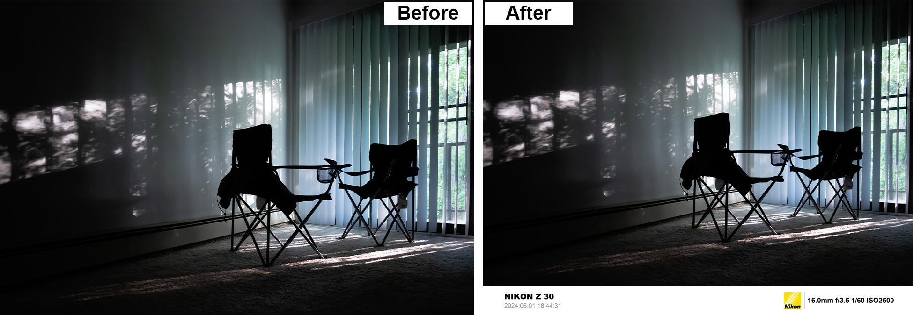

# Frame_Maker
Create a photo frame and display the information extracted from the photo's metadata

## Before and After
<!-- 
 -->

| Info | Before | After |
|:-:|:-:|:-:|
|Image:      |DSC_0043.jpg       |DSC_0043_new.jpg|
|Format:     |JPEG               |JPEG|
|Mode:       |RGB                |RGB|
|Size:       |4.47MB             |8.55MB|
|Width:      |5568               |5568|
|Height:     |3712               |4083|
|Resolution: |(300.0, 300.0)     |(300, 300)|
|Make:       |NIKON              |NIKON|
|Model:      |NIKON Z 30         |NIKON Z 30|
|Date:       |2024:06:01 18:44:31|2024:06:01 18:44:31|
|Shutter:    |1/60               |1/60|
|Aperture:   |3.5                |3.5|
|ISO:        |2500               |2500|
|FocalLength:|16.0               |16.0|